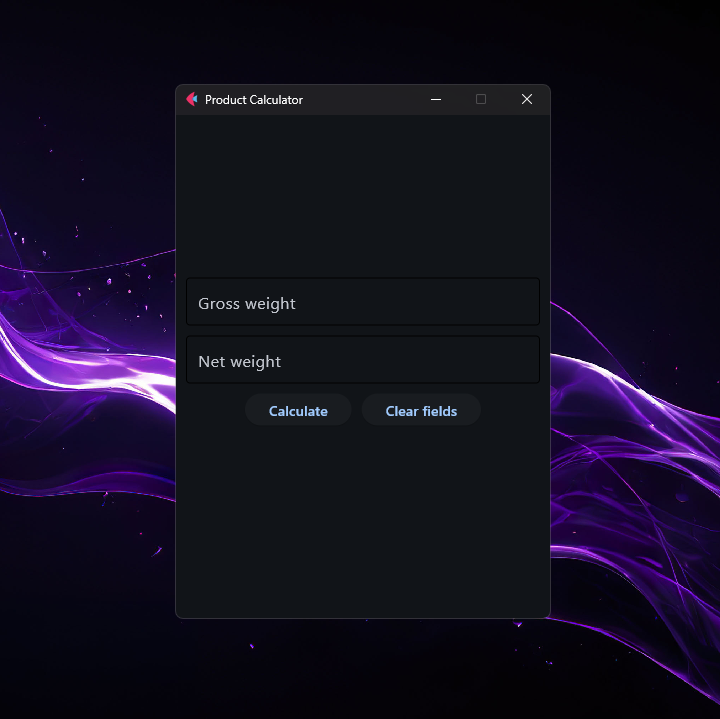

# Product Calculator

This is a product calculator project that allows you to calculate the weight of packaging and a sample based on the gross and net weight entered by the user.



## Requirements

- Python 3.12
- Flet

## Installation

1. Clone the repository:

   ```bash
   git clone <REPOSITORY_URL>
   cd ProductCalculator
   ```

2. Create a virtual environment:

   ```bash
   python -m venv .venv
   ```

3. Activate the virtual environment:

   - On Windows:

     ```bash
     .venv\Scripts\activate
     ```

   - On macOS and Linux:

     ```bash
     source .venv/bin/activate
     ```

4. Install the dependencies:

   ```bash
   pip install -r requirements.txt
   ```

## Usage

To run the application, make sure the virtual environment is activated and execute the following command:

## Contributions

Contributions are welcome. If you would like to contribute, please open an issue or submit a pull request.

## License

This project is licensed under the MIT License. Please refer to the LICENSE file for more details.